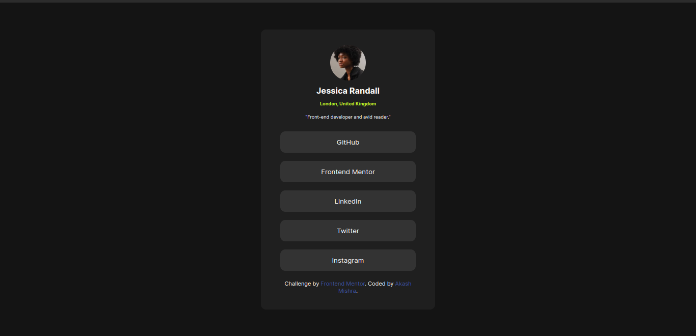
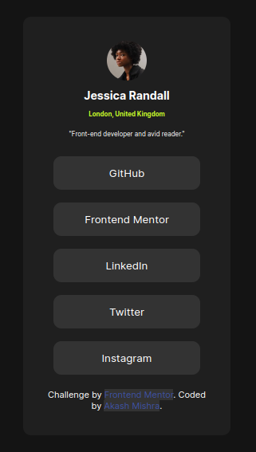

# Frontend Mentor - Social links profile solution

This is a solution to the [Social links profile challenge on Frontend Mentor](https://www.frontendmentor.io/challenges/social-links-profile-UG32l9m6dQ). Frontend Mentor challenges help you improve your coding skills by building realistic projects.

## Table of contents

- [Overview](#overview)
  - [The challenge](#the-challenge)
  - [Screenshot](#screenshot)
  - [Links](#links)
- [My process](#my-process)
  - [Built with](#built-with)
  - [What I learned](#what-i-learned)
  - [Useful resources](#useful-resources)
- [Author](#author)
- [Acknowledgments](#acknowledgments)

## Overview

### The challenge

Users should be able to:

- See hover and focus states for all interactive elements on the page

### Screenshot

#### Mobile view

### Links

- Solution URL: [here](https://your-solution-url.com)
- Live Site URL: [here](https://your-live-site-url.com)

## My process

### Built with

- Semantic HTML5 markup
- CSS custom properties
- Flexbox
- CSS Grid
- Mobile-first workflow

### What I learned

In this project I learned about how to use flexbox and make a linktree like page.

### Useful resources

- [Example resource 1](https://www.youtube.com/watch?v=UUjNEMXZA-k) - This helped me to add responsiveness in the project.

## Author

- LinkedIn - [@akashmishrahaha](https://www.linkedin.com/in/akashmishrahaha/)
- Frontend Mentor - [@akashmishrahaha](https://www.frontendmentor.io/profile/akashmishrahaha)
- Twitter - [@akashmishrahaha](https://twitter.com/akashmishrahaha)

## Acknowledgments

I would like to thanks frontend mentor community who guided me in this project.
